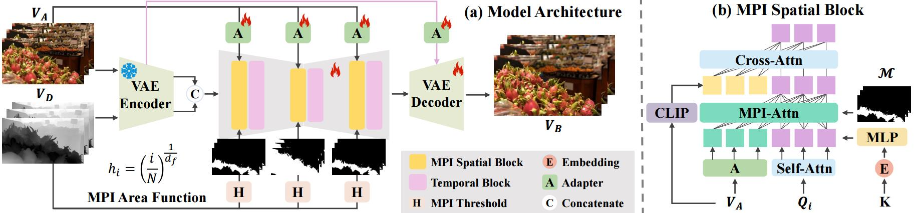

# Any-to-Bokeh: One-Step Video Bokeh via Multi-Plane Image Guided Diffusion

<a href="https://arxiv.org/abs/2505.21593"></a>&nbsp;
<a href="https://vivocameraresearch.github.io/any2bokeh/"></a>&nbsp;
<a href="http://www.apache.org/licenses/LICENSE-2.0"></a><br>


<p>
      📖<strong>TL;DR</strong>: <strong>Any-to-Bokeh</strong> is a novel one-step video bokeh framework that converts arbitrary input videos into temporally coherent, depth-aware bokeh effects.
</p>


## ✅ ToDo List for Any-to-Bokeh Release

- [x] Release the demo inference files and pre-trained weights
- [x] Release the inference pipeline
- [ ] Release the training files

## :wrench: Installation

```bash
conda create -n any2bokeh python=3.10 -y
conda activate any2bokeh
# The default CUDA version is 12.4, please modify it according to your configuration.

# Install pytorch. 
pip install torch==2.4.1 torchvision==0.19.1 torchaudio==2.4.1 --index-url https://download.pytorch.org/whl/cu124

# Clone repo
git clone https://github.com/vivoCameraResearch/any-to-bokeh.git
cd any2bokeh
pip install -r requirements.txt
```

## ⏬ Demo Inference
**We obtained 8 demos from DAVIS dataset**
1. Download demo data in [google drive]() in ```./demo_dataset``` folder. 
2. Download the pre-trained weights in in [google drive]() in ```./checkpoints``` folder.
3. Run the demo script ```python test/inference_demo.py```. The results will save in the ```./output``` folder.

## :runner: Inference Custom Video
Before bokeh rendering, two data preprocessing steps are required.

### Data Preprocessing

#### 1. Get Object Mask.
We recommend using [SAM2](https://github.com/facebookresearch/sam2) to get the mask of the focusing target.

#### 2. Depth Prediction.
First, split the video into frames, place it in a folder, and use the [utils/script_mp4.py](utils/split_mp4.py).
```bash
python utils/split_mp4.py input.mp4
```

Then, install the [video depth anything](https://github.com/DepthAnything/Video-Depth-Anything) to get depth information for each frame by our [script](utils/pre_process.py). 
```bash
python utils/pre_process.py \
    --img_folder path/to/images \
    --mask_folder path/to/masks \  # Path to the mask obtained via sam2
    --disp_dir output/directory \
```

### Case1: Fixed focus plane
Write the folder ```aif_folder``` that stores the video frames, the corresponding folder ```disp_folder``` that has been preprocessed, and the value ```k``` representing the intensity of bokeh into a CSV file in the following format (like [demo.csv](csv_file/demo.csv)):

| aif_folder                    | disp_folder                     | k  |
|-------------------------------|---------------------------------|----|
| demo_dataset/videos/xxx | demo_dataset/disp/xxx    | 16 |
| demo_dataset/videos/xxx | demo_dataset/disp/xxx    | 16 |

Then, run the script 
```bash
python test/inference_demo.py --val_csv_path your-csv-file-path
```

### Case2: Changed blur strength
First, define the blur strength ```k``` for each frame. Specifically, the filename of the depth file for each frame needs to be modified. We provide a simple modification [script](utils/customize_k.py) for this purpose.

Next, the CSV configuration for case1 should be updated to the following template(e.g., [change_k_demo.csv](csv_file/demo_change_k.csv)):

| aif_folder                    | disp_folder                     | k  |
|-------------------------------|---------------------------------|----|
| demo_dataset/videos/xxx | demo_dataset/disp_change_k/xxx    | change |

Then, run the script
```bash
python test/inference_demo.py --val_csv_path csv_file/demo_change_f.csv
```

### Case3: Changed focus plane
We use the number identified by ```_zf_``` to represent the disparity value of the focus plane. You can customize this value for each frame to adjust the focus plane. We provide a simple modification [script](utils/customize_f.py) for this purpose. 

Next, the CSV configuration is the same as in case1 (e.g., [change_f_demo.csv](csv_file/demo_change_f.csv)):

| aif_folder                    | disp_folder                     | k  |
|-------------------------------|---------------------------------|----|
| demo_dataset/videos/xxx | demo_dataset/disp_change_f/xxx    | change |

Then, run the script
```bash
python test/inference_demo.py --val_csv_path csv_file/demo_change_f.csv
```

## 📜 Acknowledgement
This codebase builds on [SVD_Xtend](https://github.com/pixeli99/SVD_Xtend). Thanks for open-sourcing! Besides, we acknowledge following great open-sourcing projects:
- SAM2 (https://github.com/facebookresearch/sam2).
- Video-Depth-Anything (https://github.com/DepthAnything/Video-Depth-Anything).


## 🌏 Citation

```bibtex
@article{yang2025any,
  title={Any-to-Bokeh: One-Step Video Bokeh via Multi-Plane Image Guided Diffusion},
  author={Yang, Yang and Zheng, Siming and Chen, Jinwei and Wu, Boxi and He, Xiaofei and Cai, Deng and Li, Bo and Jiang, Peng-Tao},
  journal={arXiv preprint arXiv:2505.21593},
  year={2025}
}
```

## 📧 Contact

If you have any questions and improvement suggestions, please email Yang Yang (yangyang98@zju.edu.cn), or open an issue.
